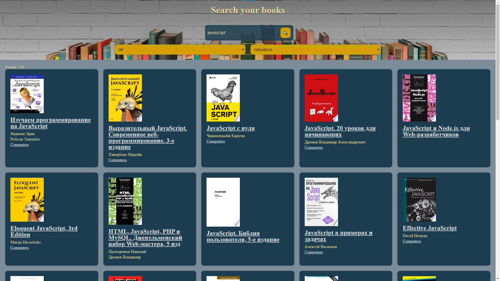

# Book-Searche
Book Searcher is a React app that allows users to search for books using the Google Books API. Users can enter a search query and the app will display a list of books that match the query, along with the book's title, author, and cover image.

## Demo Live 
https://test-tasks-f-job.vercel.app/

## Docker repository 

https://hub.docker.com/repository/docker/avtann/book-searcher/general

## Docker image getting started 

  1. `docker pull avtann/book-searcher:latest`

  2. `docker run -p 80:80 avtann/book-searcher`
  
  Run these commands and app will be start up in - http://localhost:80

## Technologies

## Screen

